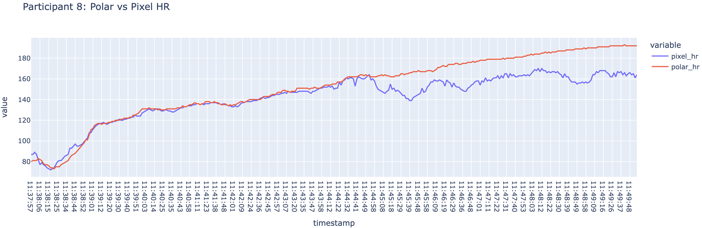

# Google Pixel Watch 3 Validation

Analysis code and data for a laboratory validation of the **Google Pixel Watch 3** against criterion measures for **VO₂max**, **energy expenditure (EE)** and **heart rate (HR)**.

| Outcome | Index device | Criterion |
|---|---|---|
| VO₂max (mL·kg⁻¹·min⁻¹) | Pixel Watch 3 estimate | COSMED indirect calorimetry (maximal test) |
| Energy expenditure (kcal) | Pixel Watch 3 | COSMED indirect calorimetry |
| Heart rate (bpm) | Pixel Watch 3 | Polar H10 chest strap |

The study enrolled **34 participants** (`p01`–`p34`).

---

## Repository contents

```
.
├── BlandAltman_mae_mape.ipynb        # Agreement analysis for VO₂max and EE
├── VO2max_EnergyExpenditure_data.csv # Participant-level criterion and device values
├── p8_hr_lineplot.png                # Example HR traces: Polar H10 vs Pixel Watch
├── p28_hr_lineplot.png
└── p29_hr_lineplot.png
```

---

## Data dictionary

`VO2max_EnergyExpenditure_data.csv` contains one row per participant.

| Column | Description |
|---|---|
| `participant_id` | Pseudonymised participant ID (`p01`–`p34`) |
| `test_date` | Date of laboratory testing (mixed formats; parsed day-first in the notebook) |
| `vo2max_attained` | Whether true VO₂max was attained during criterion testing (`Yes`/`No`) |
| `cosmed_vo2max` | Criterion VO₂max from COSMED (mL·kg⁻¹·min⁻¹) |
| `pixel_vo2max` | Pixel Watch 3 VO₂max estimate (mL·kg⁻¹·min⁻¹) |
| `pixel_vo2max_estimate_date` | Date the Pixel Watch VO₂max estimate was recorded |
| `include_vo2` | Inclusion flag for VO₂max analysis (`y`/`n`) |
| `cosmed_ee` | Criterion energy expenditure from COSMED (kcal) |
| `pixel_ee` | Pixel Watch 3 energy expenditure (kcal) |

Missing values are coded as `-` or `no` and are coerced to `NaN` during processing.

---

## Analysis

The notebook `BlandAltman_mae_mape.ipynb` computes agreement between the index device and the criterion for a single paired outcome (VO₂max **or** EE). It is not intended for HR, which has repeated measures within participants and needs a different approach.

**1. Data processing**
- Parse `test_date` to datetime (`format='mixed'`, `dayfirst=True`)
- Coerce measurement columns to numeric
- Drop participants with missing criterion or index values
- For VO₂max, restrict to participants who attained true VO₂max (`include_vo2 == 'y'`, n = 26)

**2. Bland-Altman limits of agreement**
- Bias computed as **index − criterion**
- 95% limits of agreement (bias ± 1.96 SD)
- 95% CI for the bias and for each limit of agreement, using SE(LoA) = SD × √(1/n + 1.96² / (2(n − 1)))
- Bland-Altman plot

**3. Mean absolute percentage error (MAPE)**
- Function-based and step-by-step manual calculation
- 95% CI using the *t*-distribution (small-sample)

**4. Mean absolute error (MAE)**
- Manual calculation, cross-checked against `sklearn.metrics.mean_absolute_error`
- 95% CI using the *t*-distribution

### Switching between VO₂max and EE

Three cells control which outcome is analysed. To run the VO₂max analysis, change:

```python
# Drop NaN values
df = df.dropna(subset=['pixel_vo2max', 'cosmed_vo2max'])

# Drop participants who didn't attain VO2max (uncomment)
df = df.loc[df['include_vo2'] == 'y']

# Define criterion and index measures
criterion = df['cosmed_vo2max']
index = df['pixel_vo2max']

# Plot labels
unit = 'mL/kg/min'
metric = 'VO$_2$ max'
```

The notebook is saved configured for **energy expenditure**.

---

## Results snapshot: energy expenditure

From the saved notebook output (n = 30 after removing missing values):

| Statistic | Value |
|---|---|
| Mean COSMED | 173.07 kcal |
| Mean Pixel Watch 3 | 164.63 kcal |
| Bias (Pixel − COSMED) | −8.43 kcal (95% CI −20.18 to 3.31) |
| Lower LoA | −72.75 kcal (95% CI −93.04 to −52.46) |
| Upper LoA | 55.88 kcal (95% CI 35.59 to 76.18) |
| MAE | 26.10 kcal (95% CI 18.22 to 33.98) |
| MAPE | 15.02% (95% CI 10.70 to 19.33) |

---

## Heart rate traces

The `p*_hr_lineplot.png` files show second-by-second HR from the Polar H10 and the Pixel Watch 3 across an incremental test for selected participants. For example, in participant 8 the two devices track closely at low and moderate intensities, with the Pixel Watch diverging from and underestimating the chest strap at higher heart rates.



---

## Getting started

**Requirements:** Python 3.13 (developed on 3.13.7) and the following packages:

```
pandas
numpy
scipy
matplotlib
plotly
scikit-learn
jupyter
```

**Run:**

```bash
git clone https://github.com/rorylambe/googlepixelwatch-validation.git
cd googlepixelwatch-validation
pip install pandas numpy scipy matplotlib plotly scikit-learn jupyter
jupyter notebook BlandAltman_mae_mape.ipynb
```

The notebook reads `VO2max_EnergyExpenditure_data.csv` from the working directory.

---

## Reusing the workflow for other devices

Sections 2–4 are device-agnostic: once `criterion` and `index` are defined as paired pandas Series, the Bland-Altman, MAPE and MAE code runs unchanged. Only the data-loading and cleaning steps in Section 1 need adapting to a new dataset.

---

## Corresponding author

**Rory Lambe**, University College Dublin

## Citation

If you use this code or data, please cite the associated manuscript:
Lambe, Rory, et al. "The accuracy of VO2 max, heart rate and energy expenditure measurements from Google Pixel Watch 3." PloS one 21.9 (2026): e0356808.
